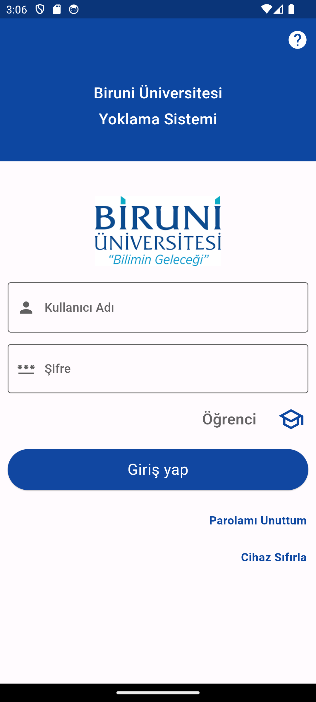
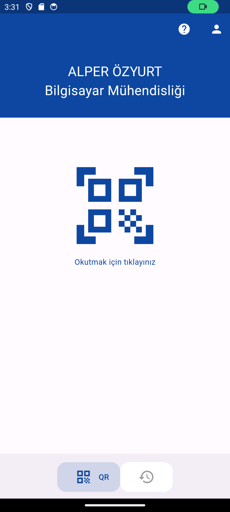
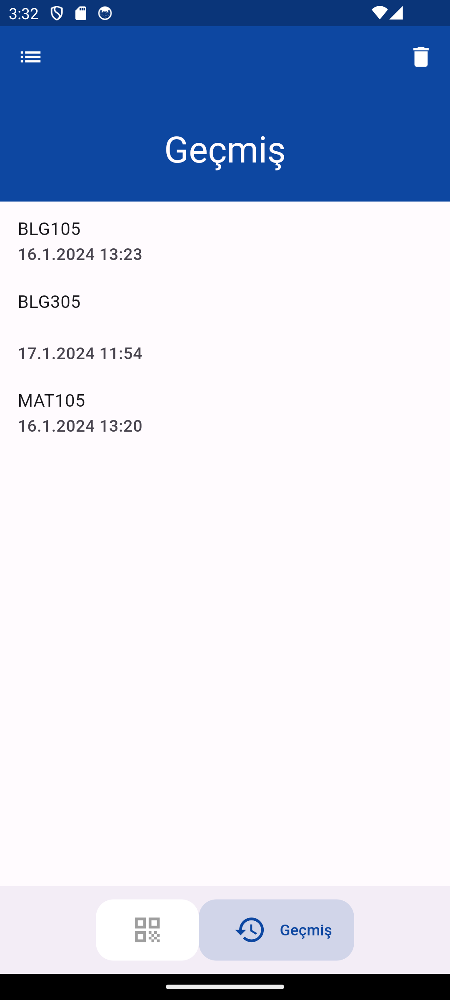
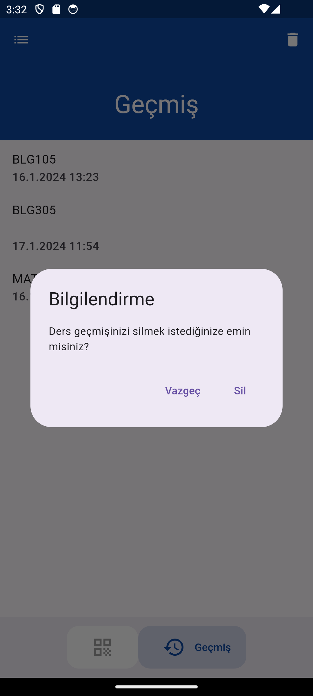
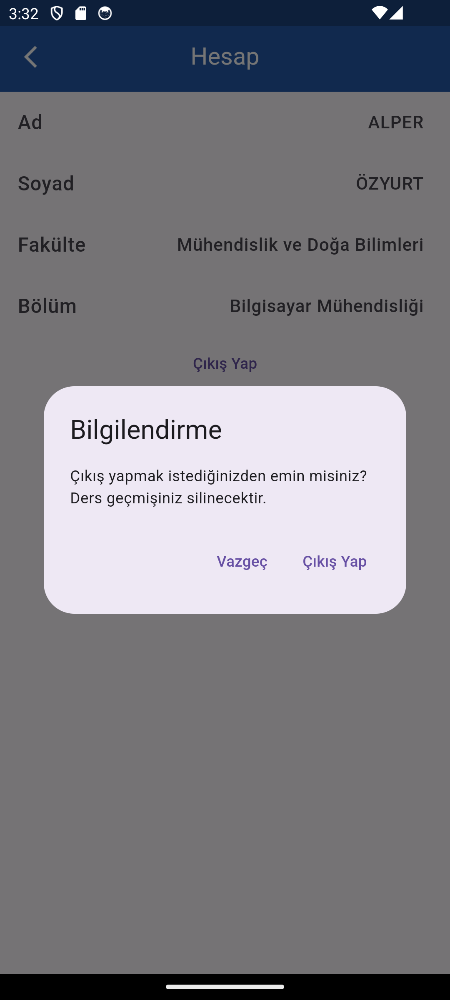

    
    
    
    
    
    
    

<h1>
    Biruni Yoklama Uygulaması
    
</h1>

    Biruni Üniversitesi Biruni Yoklama uygulaması ile aynı fonksiyonelliğe ve tasarıma sahip bir kopya uygulamadır. Flutter ile geliştirilmiş ve veritabanı olarak Firebase kullanılmıştır.

    Giriş yapılırken öğrenci numarası kullanılır. Öğrenci numarasının sonuna otomatik olarak @st.biruni.edu.tr eklenir ve girilen öğrenci numarasına göre uygulama çalışır. Öğrenci numaraları, QR kod ile aldığı yoklamalar ve buna benzer bilgiler firebasede her kullanıcının öğrenci numarası altında saklanır. Bu sayede öğrenci numarasına göre kullanıcıya ait değerler getirilir. Silme işlemi yapıldığı zaman yoklaması alınan, kaydedilen ders veritabanından silinir. Veritabanında bulunmayan herhangi bir kullanıcı giriş yapamaz. Kullanıcı bilgileri uygulamaya giriş yapılmadığı sürece sadece veritabanında saklanır.
   </ p>

 ## Kurulum

1. `git clone https://github.com/alperozyyurt4/BiruniQrApplication`
2. Projeyi klonladıktan sonra `ctrl + shift + b` tuşlarına basıp `flutter build aar`seçeneğini seçmelisiniz
3. `flutter pub get` komutunu terminalde calıstırın
4. Firebase kurulumu için https://firebase.google.com sitesine gidip proje kurulum adımlarını takip ediniz.
